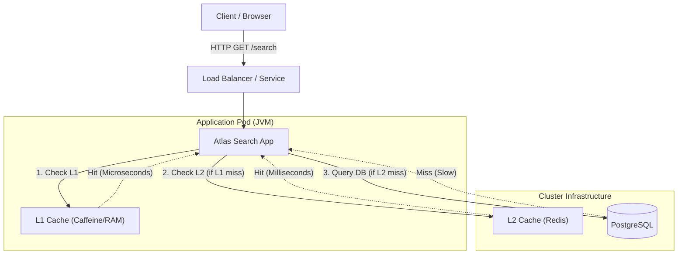

# Atlas Search 🌍🏨

**High-Performance Hotel Search API** built with Java 21, Spring Boot 3, and a Multi-Level Caching strategy (L1
Caffeine + L2 Redis), orchestrated on Kubernetes.

## 🏗️ Architecture

This project demonstrates a microservices architecture designed for extreme low latency and high resilience.

### Multi-Level Caching Strategy (L1 + L2)

Instead of hitting the database for every request, we use a "Cache-Aside" pattern with two layers:



1. **L1 (Caffeine):** In-memory. Instant access. Holds "hot" data.
2. **L2 (Redis):** Distributed. Survives app restarts. Shared across pods.
3. **Database (Postgres):** Source of truth. Only queried on cache miss.

---

## 🛠️ Tech Stack

* **Core:** Java 21, Spring Boot 3.4
* **Data:** PostgreSQL, QueryDSL (Type-safe SQL)
* **Caching:** Caffeine (Local), Redis (Distributed)
* **Infrastructure:** Kubernetes (Kind), Helm, Docker
* **Observability:** Prometheus, Grafana, Micrometer, OpenTelemetry
* **Docs:** OpenAPI (Swagger UI)

---

## 🚀 Getting Started

### Prerequisites

* Docker Desktop (with at least **6GB RAM** allocated)
* [Kind](https://kind.sigs.k8s.io/) (Kubernetes in Docker)
* [Helm](https://helm.sh/) (Package Manager for K8s)
* [Kubectl](https://kubernetes.io/docs/tasks/tools/)

### 1. Build the Application

Since this project requires **Java 21** but your local machine might be on Java 8 or 11, we can use Docker to perform
the build in an isolated container.
Otherwise just run `mvn clean package -DskipTests` in your local environment, or use the wrapper (
`./mvnw clean package -DskipTests` - depending on your default java version)

```bash
# 1. Compile and Package (This runs Maven inside a Java 21 container)
# The resulting .jar will appear in your local target/ folder
docker run --rm -v "$(pwd)":/usr/src/app -w /usr/src/app maven:3.9.6-eclipse-temurin-21 mvn clean package -DskipTests

# 2. Build the Docker Image
docker build -t atlas-search:v1 .
```

### 2. Create the Kubernetes Cluster

We use `kind` to simulate a multi-node cluster (1 Control Plane + 2 Workers).

```bash
# Create cluster using the config in k8s/kind/cluster-config.yml
# (Ensures port 30080 maps to localhost:8080)
kind create cluster --config k8s/kind/cluster-config.yml --name atlas-cluster
```

### 3. Deploy Platform (DB & Cache)

Deploy Postgres (Persistent Volume) and Redis.

```bash
kubectl apply -f k8s/platform/01-postgres.yml
kubectl apply -f k8s/platform/02-redis.yml

# Wait until they are Running
kubectl get pods -w
```

### 4. Deploy Application

Load the local image into the cluster and deploy.

```bash
# 1. Sideload the image into Kind nodes
kind load docker-image atlas-search:v1 --name atlas-cluster

# 2. Deploy the App and Service Monitors
kubectl apply -f k8s/app/atlas-search.yml
kubectl apply -f k8s/app/service-monitor.yml
```

### 5. Deploy Observability Stack

Install Prometheus and Grafana using Helm.

```bash
# Create namespace
kubectl create namespace monitoring

# Install the stack
helm repo add prometheus-community https://prometheus-community.github.io/helm-charts
helm repo update
helm install atlas-monitoring prometheus-community/kube-prometheus-stack -n monitoring
```

---

## 🎮 Usage

Once all pods are `Running` (check with `kubectl get pods -A`), you can access the application.

### Swagger UI (API Docs)

Access the API documentation and test endpoints directly:
👉 **[http://localhost:8080/atlas-search/swagger-ui/index.html](http://localhost:8080/atlas-search/swagger-ui/index.html)**

### Example Request (Curl)

```bash
curl -X GET "http://localhost:8080/atlas-search/hotels/search?city=Lisbon&minStars=4" -H "accept: application/json"
```

---

## 📊 Observability (Grafana)

To view the dashboards, we need to access Grafana inside the cluster.

**1. Get Admin Password:**

```bash
kubectl get secret --namespace monitoring atlas-monitoring-grafana -o jsonpath="{.data.admin-password}" | base64 --decode ; echo
```

**2. Open Tunnel:**

```bash
kubectl port-forward svc/atlas-monitoring-grafana 3000:80 -n monitoring
```

**3. Login:**

* URL: [http://localhost:3000](http://localhost:3000)
* User: `admin`
* Pass: *(The output from step 1)*

**4. View Dashboards:**
Navigate to **Dashboards > Spring Boot 3.x Statistics** (or import dashboard ID `19004`) to see Real-Time Heap, CPU, and
Prometheus metrics.

---

## 🧹 Cleanup

To stop everything and save resources:

```bash
kind delete cluster --name atlas-cluster
```
