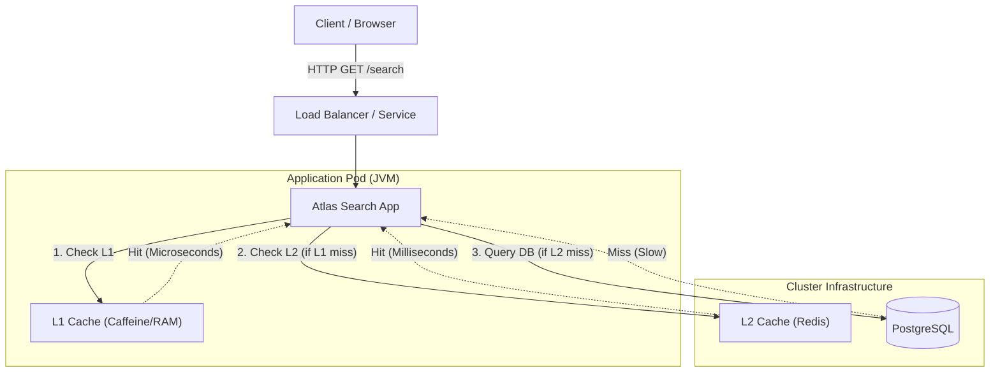

# Atlas Search 🌍🏨

**High-Performance Hotel Search API** built with Java 21, Spring Boot 3, and a Multi-Level Caching strategy (L1
Caffeine + L2 Redis), orchestrated on Kubernetes.

## 🏗️ Architecture

This project demonstrates a microservices architecture designed for extreme low latency and high resilience.

### Multi-Level Caching Strategy (L1 + L2)

Instead of hitting the database for every request, we use a "Cache-Aside" pattern with two layers:



1. **L1 (Caffeine):** In-memory. Instant access. Holds "hot" data.
2. **L2 (Redis):** Distributed. Survives app restarts. Shared across pods.
3. **Database (Postgres):** Source of truth. Only queried on cache miss.

---

## 🛠️ Tech Stack

* **Core:** Java 21, Spring Boot 3.4
* **Data:** PostgreSQL, QueryDSL (Type-safe SQL)
* **Caching:** Caffeine (Local), Redis (Distributed)
* **Infrastructure:** Kubernetes (Kind), Helm, Docker
* **Observability:** Prometheus, Grafana, Micrometer, OpenTelemetry
* **Docs:** OpenAPI (Swagger UI)

---

## 🚀 Getting Started

We use a **Makefile** to automate the entire lifecycle of the project, ensuring a consistent environment and
preventing "works on my machine" issues.

### Prerequisites

* **Make** (Pre-installed on macOS/Linux)
* Docker Desktop
* [Kind](https://kind.sigs.k8s.io/) (Kubernetes in Docker)
* [Helm](https://helm.sh/) (Package Manager for K8s)
* [Kubectl](https://kubernetes.io/docs/tasks/tools/)

### ⚡️ Quick Start

To create the cluster, build the app, and deploy the entire stack (Database, Cache, Monitoring, and Application) in one
go:

```bash
make up
```

Wait until all pods are `Running` (check with `kubectl get pods -A`).

---

### 🐢 Step-by-Step (Under the Hood)

If you prefer to run steps individually to understand the process:

#### 1. Create the Kubernetes Cluster

Creates a multi-node cluster (1 Control Plane + 2 Workers) and ensures port mapping.

```bash
make create-cluster
```

#### 2. Deploy Platform (DB & Cache)

Deploys Postgres and Redis with Persistent Volumes.

```bash
make install-platform
```

#### 3. Deploy Observability Stack

Installs Prometheus and Grafana using Helm. *Note: This must run before the app to register ServiceMonitors.*

```bash
make install-monitoring
```

#### 4. Build the Application

Uses a **Dockerized Build** process. This compiles the Java code inside a container (Java 21) and builds the final
image, ensuring compatibility regardless of your local Java version.

```bash
make build-app
```

#### 5. Deploy Application

Sideloads the image into Kind and applies the Kubernetes manifests.

```bash
make install-app
```

---

## 🎮 Usage

Once the stack is up, you can access the application.

### Swagger UI (API Docs)

Access the API documentation and test endpoints directly:
👉 **[http://localhost:8080/atlas-search/swagger-ui/index.html](http://localhost:8080/atlas-search/swagger-ui/index.html)**

### Example Request (Curl)

```bash
curl -X GET "http://localhost:8080/atlas-search/hotels/search?city=Lisbon&minStars=4" -H "accept: application/json"
```

---

## 📊 Observability (Grafana)

To view the dashboards, we need to access Grafana inside the cluster.

**1. Get Admin Password:**

```bash
kubectl get secret --namespace monitoring atlas-monitoring-grafana -o jsonpath="{.data.admin-password}" | base64 --decode ; echo
```

**2. Open Tunnel:**

```bash
kubectl port-forward svc/atlas-monitoring-grafana 3000:80 -n monitoring
```

**3. Login:**

* URL: [http://localhost:3000](http://localhost:3000)
* User: `admin`
* Pass: *(The output from step 1)*

**4. View Dashboards:**
Navigate to **Dashboards > Spring Boot 3.x Statistics** (or import dashboard ID `19004`) to see Real-Time Heap, CPU, and
Prometheus metrics.

---

## 🧹 Cleanup

To destroy the cluster and free up resources:

```bash
make down
```